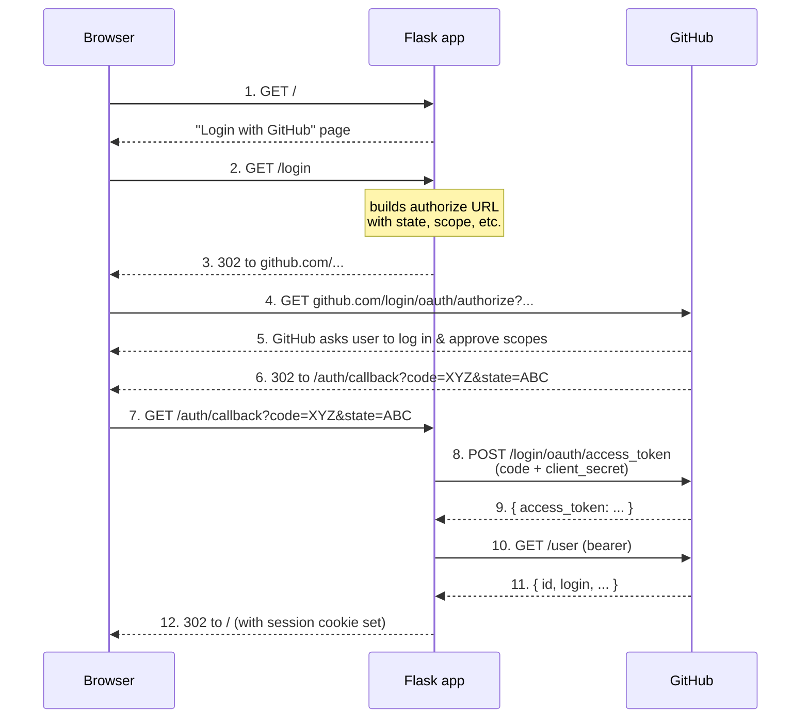

# OAuth 2.0 Authorization Code Flow — Explained

A learning companion to this project. The [README](../README.md) tells you *how to run it*; this document tells you *why each piece exists*. We start from "what problem is OAuth solving?" and end at the line of Python that solves it.

---

## 1. The problem OAuth solves

Imagine you build a web app that wants to show a user their GitHub repositories. The naive approach:

> "Please type your GitHub username and password into my app, and I'll log in as you."

This is terrible:

- Your app sees the user's password (a secret that unlocks **everything** they own on GitHub).
- The user has to trust you to store it safely.
- Revoking access means changing the password (which breaks every other app too).
- You get *all* permissions, even though you only need to read repo names.

**OAuth 2.0** is a protocol that solves this. Instead of handing over a password, the user is sent to GitHub, logs in *there*, and tells GitHub: "Yes, I authorize this app to read my repos." GitHub then hands your app a scoped, revocable **access token**. Your app never sees the password.

Three actors and one secret you must keep straight:

| Actor                    | In this project           | Role                                                                  |
| ------------------------ | ------------------------- | --------------------------------------------------------------------- |
| **Resource Owner**       | The human user            | Owns the data (their GitHub profile, repos)                           |
| **Client**               | This Flask app            | Wants to access the data on the user's behalf                         |
| **Authorization Server** | `github.com/login/oauth/` | Authenticates the user and issues tokens                              |
| **Resource Server**      | `api.github.com`          | Serves the protected data, accepts tokens issued by the auth server   |

For GitHub, the authorization server and resource server are run by the same company, but the protocol treats them as distinct — that's why the URLs are different.

---

## 2. Why "Authorization Code" specifically

OAuth 2.0 defines several flows ("grant types"). The one this app uses is the **Authorization Code flow**, which is the right choice when:

- The client is a **server-side web app** (it can keep a secret on the server).
- A human is present in a browser to click "Authorize".

Other flows you'll see mentioned but **not** used here:

- **Implicit flow** — token returned directly in the URL fragment. Deprecated; was for browser-only apps before PKCE existed.
- **Client Credentials** — no user involved; one server talking to another (e.g. a cron job).
- **Device Code** — for TVs, CLIs, anything without a browser.
- **Authorization Code + PKCE** — the modern variant for public clients (mobile apps, SPAs) that *can't* keep a secret.

The defining feature of the Authorization Code flow is that the browser only ever sees a short-lived **code**, not the access token. The code is exchanged for the token in a **back-channel** (server-to-server) request that includes the client secret. This means an attacker who only sees browser traffic never sees the token.

---

## 3. The flow, step by step



Steps 1–6 are the **front channel** (everything passes through the browser). Steps 8–11 are the **back channel** (server-to-server, the browser never sees the token).

---

## 4. Mapped to this project's code

### 4a. Registration (one-time, before any users show up)

In `app.py`:

```python
oauth.register(
    name="github",
    client_id=_require_env("GITHUB_CLIENT_ID"),
    client_secret=_require_env("GITHUB_CLIENT_SECRET"),
    access_token_url="https://github.com/login/oauth/access_token",
    authorize_url="https://github.com/login/oauth/authorize",
    api_base_url="https://api.github.com/",
    client_kwargs={"scope": "read:user"},
)
```

What each field is:

- **`client_id`** — public identifier for *this app* on GitHub. Safe to ship in a frontend.
- **`client_secret`** — proves to GitHub that token-exchange requests really come from this app's server. **Must never leave the server.** That's why it's in `.env`, not in templates or JS.
- **`authorize_url`** — where to send the user's browser in step 4.
- **`access_token_url`** — where the server POSTs the code in step 8.
- **`api_base_url`** — base URL for resource-server calls (steps 10, and the `/user/repos` call later).
- **`scope: "read:user"`** — the **principle of least privilege**. We only need to read the user's profile, so we don't ask for `repo` (write access) or `user:email`. GitHub will show this list to the user on the consent screen.

### 4b. Kick-off: `GET /login`

```python
@app.route("/login")
def login():
    redirect_uri = url_for("callback", _external=True)
    return oauth.github.authorize_redirect(redirect_uri)
```

`authorize_redirect` does three things under the hood:

1. Generates a random **`state`** parameter and stores it in the Flask session.
2. Builds the authorize URL: `https://github.com/login/oauth/authorize?client_id=...&redirect_uri=...&scope=read:user&state=...`.
3. Returns a 302 redirect to that URL.

**Why `state` matters.** Without it, an attacker could trick a logged-in victim into visiting `/auth/callback?code=ATTACKERS_CODE`, and your app would happily link the attacker's GitHub account to the victim's session. This is **CSRF on the OAuth callback**. The `state` parameter is a one-time random value the app generated; when the callback comes back, the app checks it matches what it stored. If it doesn't, the request didn't originate from our `/login`.

**Why `redirect_uri` must match exactly.** GitHub does a literal string comparison against the URL registered in the OAuth App settings (RFC 6749 §3.1.2). This is what stops an attacker from registering `http://evil.com/callback` against *your* client_id. That's also why the README insists on `127.0.0.1` over `localhost` — they're not the same string.

### 4c. The callback: `GET /auth/callback`

```python
@app.route("/auth/callback")
def callback():
    try:
        token = oauth.github.authorize_access_token()  # validates state
        resp = oauth.github.get("user", token=token)
        resp.raise_for_status()
        data = resp.json()
        session["user"] = {
            "id": data["id"],
            "login": data["login"],
            "name": data.get("name") or data["login"],
            "avatar_url": data.get("avatar_url"),
        }
        session["token"] = token
    except Exception as exc:
        app.logger.exception("OAuth callback failed: %s", exc)
        session.pop("user", None)
        session.pop("token", None)
    return redirect(url_for("index"))
```

`authorize_access_token()` is doing a lot in one line:

1. Reads `code` and `state` from the query string.
2. Compares `state` against what's in the session — **rejects the request if they don't match.**
3. POSTs to `access_token_url` with:
   - `client_id`
   - `client_secret`  ← the secret only the server knows
   - `code`           ← the short-lived code from the browser
   - `redirect_uri`   ← must match again
4. Receives `{"access_token": "...", "token_type": "bearer", "scope": "read:user"}` and returns it.

Then we use the token to call `GET https://api.github.com/user` and persist what we need.

**Why we store `id` separately from `login`.** GitHub usernames (`login`) can change. The numeric `id` is immutable. If you ever build a database, **`id` is the foreign key**, not `login`. Treat `login` and `name` as display-only.

### 4d. Using the token: `GET /`

```python
resp = oauth.github.get(
    "user/repos",
    params={"sort": "updated", "per_page": 5},
    token=session["token"],
)
```

This is the whole point of OAuth: now that we have a token, we can call the resource server **on the user's behalf**, but only within the `read:user` scope they consented to. Authlib attaches the token as `Authorization: Bearer <token>`.

The `try/except` that clears the session on failure handles the case where the user revoked the app on GitHub's settings page — the token becomes invalid, the call 401s, and we send them back to the login state instead of crashing.

### 4e. Logout

```python
@app.route("/logout")
def logout():
    session.pop("user", None)
    session.pop("token", None)
    return redirect(url_for("index"))
```

This is **local logout only** — it clears our session cookie. It does *not* tell GitHub to revoke the token, and it does *not* log the user out of github.com. For a real app you might also call GitHub's [token revocation endpoint](https://docs.github.com/en/rest/apps/oauth-applications#delete-an-app-token).

---

## 5. Security model: where trust lives

| Secret / value          | Who knows it                       | If leaked                                                              |
| ----------------------- | ---------------------------------- | ---------------------------------------------------------------------- |
| User's GitHub password  | The user, GitHub                   | Attacker has the user's whole GitHub account. **OAuth keeps us out of this risk.** |
| `GITHUB_CLIENT_ID`      | Public                             | Nothing — it's an identifier, not a secret                             |
| `GITHUB_CLIENT_SECRET`  | Our server, GitHub                 | Attacker can impersonate our app in token exchanges. Rotate immediately. |
| `FLASK_SECRET_KEY`      | Our server                         | Attacker can forge session cookies and log in as any user. Rotate.     |
| `access_token`          | Our server, the user's browser cookie, GitHub | Attacker can read the user's profile within scope. Revoke via GitHub's settings. |
| `state` (per-request)   | Our server, briefly the browser    | Useless after one callback                                             |
| `code` (per-request)    | Briefly the browser, then exchanged | Useless without `client_secret`; one-time use; expires in ~10 minutes |

Two layered defences worth highlighting:

1. **Why a code, not a token, in the browser?** Browser URLs end up in history, referer headers, and server logs. A code is single-use and useless without the server's `client_secret`. A token would be a persistent credential leaking into all those places.
2. **Why does `state` exist when we already have `redirect_uri` validation?** `redirect_uri` stops *other* apps from impersonating us. `state` stops attackers from injecting *their own* successful callback into a victim's session of our app. They protect against different attacks.

### Where this POC cuts corners

- **Tokens live in the signed-cookie session.** Flask signs the cookie (so it can't be tampered with) but doesn't encrypt it — the token is base64-encoded and visible in the user's browser DevTools. Fine for a learning POC. In production, store tokens server-side (Redis, DB) keyed by user id, and put only the user id in the cookie.
- **No HTTPS in dev.** GitHub allows `http://127.0.0.1` for local development as a special case. Any deployed app **must** use HTTPS or the token can be sniffed off the wire.
- **No token refresh.** GitHub's user-to-server tokens used to be long-lived; they now expire. A production app should handle 401s by using the refresh token to mint a new access token, instead of forcing re-login as we do.
- **No revocation on logout.** See §4e.

---

## 6. Glossary

- **Authorization Code** — short-lived (~10 min), one-time-use string returned to the browser in step 6. Exchanged for a token in step 8.
- **Access Token** — bearer credential used to call the resource server. Must be sent over HTTPS, in the `Authorization` header, never in URLs.
- **Bearer token** — "whoever holds it can use it." No additional proof of identity is required, which is why leaking one is bad.
- **Scope** — string(s) declaring what the token is allowed to do. GitHub's scopes are documented [here](https://docs.github.com/en/apps/oauth-apps/building-oauth-apps/scopes-for-oauth-apps). Asking for the minimum is both a security and a UX win — users are more likely to approve a small ask.
- **Front channel / back channel** — front channel = via the browser (visible to the user, redirects, query strings). Back channel = direct server-to-server HTTP (invisible to the browser, can carry secrets).
- **Consent screen** — the GitHub-rendered page in step 5 where the user sees "This app wants to: read your profile" and clicks Authorize.
- **PKCE** (Proof Key for Code Exchange) — extension where the client generates a random `code_verifier`, sends its hash (`code_challenge`) at step 4, and the verifier itself at step 8. Lets *public* clients (mobile, SPA) use the Authorization Code flow safely without a `client_secret`. Not used here because we have a real server with a real secret.

---

## 7. Further reading

- [RFC 6749 — The OAuth 2.0 Authorization Framework](https://datatracker.ietf.org/doc/html/rfc6749) — the spec. §1.2 has the same diagram as above. §4.1 is the Authorization Code flow.
- [RFC 6750 — Bearer Token Usage](https://datatracker.ietf.org/doc/html/rfc6750)
- [RFC 8252 — OAuth 2.0 for Native Apps](https://datatracker.ietf.org/doc/html/rfc8252) — covers loopback redirects and PKCE.
- [OAuth 2.0 Security Best Current Practice](https://datatracker.ietf.org/doc/html/draft-ietf-oauth-security-topics) — the current consensus on what to actually do in 2024+.
- [GitHub: Authorizing OAuth Apps](https://docs.github.com/en/apps/oauth-apps/building-oauth-apps/authorizing-oauth-apps)
- [Authlib docs: Flask OAuth Client](https://docs.authlib.org/en/latest/client/flask.html)
